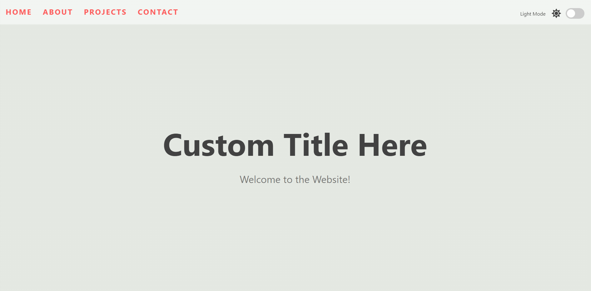

# Demo

This project is an extension of javascript20-projects : Light & Dark Mode from [ZTM courses](https://academy.zerotomastery.io/p/javascript-projects)

## feature

- A website that practice changes style dynamically with only JS and CSS .
- There are light mode and dark mode.
- save theme mode state

---

## code

- Built with HTML, CSS and Javascript.
- by toggle custom data attribute, change style.
- theme mode save in local storage.
